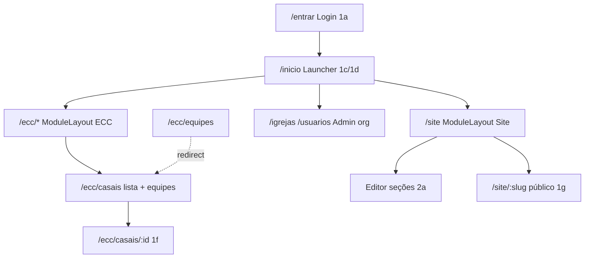

# PLAN-002 — Redesign vinho litúrgico: login, launcher, ECC, Site

**Status:** em execução  
**Origem:** canvas `prototipo/eclesias-novo-design.html`  
**Depende de:** PLAN-001 (fundação + ECC parcial + Site SPEC-005)  
**Produto:** Eclesia (nome no repo); marca visual do canvas (**Eclesias** só como referência tipográfica do design — não renomear o produto neste plano)

## Decisões fechadas

| Tema | Escolha |
|------|---------|
| Marca | Adotar paleta e tipografia do canvas (substitui marinho/dourado do BRIEF) |
| Login | **1a** — pórtico dividido (slug na URL visual) |
| Home | **1c** desktop + **1d** mobile — launcher de módulos |
| ECC equipes | **1e** — sidebar do módulo + tabela densa |
| ECC casal | **1f** — ficha dedicada |
| Site público | **1g** — one page por seções |
| Editor Site | **2a** — lista de seções + preview ao lado (**2b** fora deste plano) |

## Fidelidade ao design (obrigatório)

Três superfícies exigem **fidelidade visual e estrutural 100%** ao canvas (`#1c`/`#1d`, `#1g`, `#2a`). Não “inspirar-se” nem adaptar ao kit Innov nessas telas.

| Superfície | Canvas | Regra |
|------------|--------|-------|
| Launcher / home | **1c** + **1d** | Mesma hierarquia, tipografia, espaçamentos, top bar, grade/lista de cartões, cartão Administração, badges e copy. Desktop = 1c; viewport estreito = 1d. |
| Site público | **1g** | One page com as mesmas seções, ordem, nav sticky, hero, tipografia, CTAs, footer e ritmo visual do mock. Conteúdo vem da API; o **layout** não diverge. |
| Editor Site | **2a** | Shell vinho + lista de seções + editor + preview lateral (desktop/celular), top bar de publicação e estados (rascunho / alterações não publicadas) como no mock. |

**Como garantir**

1. Extrair medidas do canvas (cores hex, radii 7–12px, padding da top bar 56–60px, grid 3 colunas no launcher, preview ~400px no 2a) para CSS dedicado (`launcher.css`, `site-public.css`, `site-editor.css`) — não forçar `InnovPanel`/`InnovCrud` se quebrarem o layout.
2. Checklist pixel/estrutural item a item (abaixo) antes de marcar a fase como feita; comparar lado a lado com `prototipo/eclesias-novo-design.html`.
3. Dados ausentes: manter o **esqueleto visual** do mock (placeholders honestos), sem remover seções ou colapsar o layout para “simplificar”.
4. Login (1a) e ECC (1e/1f): alto alinhamento; **não** entram na regra de fidelidade 100% deste parágrafo (podem degradar campos sem API).

## Direção visual (tokens)

| Token | Valor |
|-------|-------|
| `--color-primary` | `#4E1220` (bordô profundo) |
| `--color-primary-soft` | `#6B1C2B` / `#8A2436` (ações / hover) |
| `--color-accent` | `#C88A5E` (cobre) |
| `--color-accent-muted` | `#B4703F` |
| `--color-bg` | `#F7F4EF` / `#EFEAE3` |
| `--color-surface` | `#FFFDFA` |
| `--color-ink` | `#2A1418` |
| Body | Instrument Sans |
| Headings | Newsreader |
| Mono / slug | JetBrains Mono |

Atualizar: [BRIEF.md](../product/BRIEF.md) § identidade, [front/src/assets/main.css](../../front/src/assets/main.css), [front/index.html](../../front/index.html) (Google Fonts), landing se necessário.

Arquivo de referência: copiar o HTML do canvas para `prototipo/eclesias-novo-design.html`.

## Arquitetura de navegação (mudança estrutural)

**Antes:** `AdminLayout` = TopNavbar + Sidebar flat (plataforma + ECC + site misturados).  
**Depois:**

1. **LauncherLayout** em `/inicio` — barra de contexto (paróquia + usuário) + grade de módulos; sem sidebar de app.
2. **ModuleLayout** — sidebar **do módulo** (vinho) + top bar de contexto (paróquia / comunidade) + conteúdo.
3. Links de administração (igrejas, usuários) no cartão “Administração” do launcher (como em 1c), não mais na sidebar ECC.

---

## Fase 0 — Documentação e referência

1. Copiar canvas → `prototipo/eclesias-novo-design.html`.
2. Atualizar BRIEF § identidade (vinho + fontes; remover marinho como shell).
3. ADR-0004: shell em dois níveis (launcher → module layout) + tokens de marca.
4. Spec UX curta `docs/specs/SPEC-006-shell-launcher-modulo.md` (rotas, permissões por cartão, responsivo).
5. Ajustar OpenAPI só onde o contrato HTTP mudar (ficha casal, contadores do launcher, tipos de bloco one-page).

---

## Fase 1 — Design system (front)

**Arquivos:** `main.css`, `index.html`, utilitários `.btn-*` / `.card` / `.page-eyebrow`.

- Trocar CSS variables e fontes.
- Componentes base: `BrandMark` (círculo “E”), badges cobre/vinho, avatar iniciais.
- Testes: snapshots leves ou asserts de classes críticas se já houver padrão; senão smoke visual manual + testes das views nas fases seguintes.
- Landing (`LandingView`) alinhada à nova marca (sem redesenhar conteúdo de marketing além de tokens).

---

## Fase 2 — Login pórtico (1a)

**Arquivos:** `AuthLayout.vue`, `TenantLoginView.vue`.

- Layout 50/50: painel vinho (marca + headline) + formulário em superfície clara.
- Campo organização como prefixo `eclesias.com.br/` + slug (mono).
- Links: esqueci senha, ver site da paróquia (`/site/{slug}`), cadastrar (placeholder se fluxo não existir).
- Mobile: empilhar (painel topo curto + form), ou cair no padrão cartão sem abandonar 1a no desktop.
- Testes front: render do formulário + submit mock do `authStore`.

---

## Fase 3 — Launcher / home (1c + 1d) — fidelidade 100%

**Arquivos novos/alterados:**

- `WelcomeView.vue` → vira launcher (ou `ModuleLauncherView.vue` + rota `/inicio`).
- Componentes fiéis ao mock: `ModuleCard.vue`, `AdminQuickPanel.vue`, `LauncherTopBar.vue` (CSS próprio, sem card genérico Innov).
- Store/helper: módulos habilitados por permissão (`telas.ecc`, `telas.site`, igrejas, usuários…).

**Desktop (1c) — checklist de fidelidade**

- [ ] Top bar `#4E1220`, altura ~56px: marca “E” + Eclesia | seletor paróquia/comunidades | nome · papel + avatar iniciais cobre
- [ ] Fundo `#F7F4EF`; eyebrow “Boa tarde/…”, título Newsreader (“Onde você quer trabalhar hoje, {nome}?”), subtítulo de acesso
- [ ] Grid 3 colunas: ECC, Site, Pastorais, Financeiro, “Outros módulos” (tracejado), cartão Administração vinho com links
- [ ] Cartões: ícone letra, título serif, descrição, meta (contagens / slug / “em breve”), badge de atenção quando houver
- [ ] Hover/borda ativa como no mock (borda vinho + sombra suave)

**Mobile (1d) — checklist de fidelidade**

- [ ] Header vinho com saudação + chip de comunidade
- [ ] Lista vertical de módulos (ícone + título + meta + badge numérico), não grid 3 colunas

**Contadores / badges** (“2 pendências”, “publicado”, “18 equipes · 76 casais”):

- Preferir dados reais; se API ainda não entregar, **manter o slot visual** do badge/meta (não remover o elemento do layout).
- Endpoint agregado `GET /api/v1/me/launcher` se necessário — OpenAPI + testes antes.

**Shell:** ao entrar em `/ecc/*` ou `/site`, usar `ModuleLayout`; botão “← Todos os módulos” volta ao launcher.

---

## Fase 4 — ECC: equipes (1e) e ficha do casal (1f)

### 4.1 Module sidebar ECC

Itens: **Casais** (lista + gestão secundária de equipes), Encontros (placeholder), Relatórios (placeholder).  
Rodapé: texto de coordenação se houver dado; senão omitir.

### 4.2 Casais + equipes — `EccCasaisView.vue`

- Tela única em `/ecc/casais`: lista de casais, filtro por equipe, import, CRUD de casal.
- **Gerenciar equipes** (secundário, `ecc.equipes.manage`): painel full-width com listar/criar/editar equipe; “Ver casais” aplica o filtro e volta à lista.
- `/ecc/equipes` redireciona para `/ecc/casais`.
- Layout responsivo: toolbar e ações empilhadas no mobile.

### 4.3 Ficha do casal (1f) — nova rota

- Rota: `/ecc/casais/:id` → `EccCasalDetailView.vue`.
- Header vinho: iniciais, nomes, chips (função, encontro, comunidade), Editar / Trocar de equipe.
- Grid: bloco Ele / Ela (dados de `Pessoa`), casamento/família, histórico no movimento.

**API / domínio:**

| UI no canvas | Situação no código |
|--------------|-------------------|
| Nome, telefone, e-mail, nascimento | Via `Pessoa` relacionada — expor no Resource do casal |
| Sacramentos | **Não existe** — UI mostra “—” ou omitir até spec futura |
| Casamento, filhos, endereço | Já em `Casal` (`data_casamento`, `filhos`, endereço encryptable) |
| Histórico no movimento | **Não existe** timeline — montar lista derivada (`ecc_origem`, etapas, `funcao_dirigente`) ou seção vazia com CTA; **não** inventar tabela sem spec |

- OpenAPI: garantir `GET /ecc/casais/{id}` com pessoas embutidas (criar/ajustar se list-only).
- Lista `EccCasaisView`: ação “abrir” → detalhe; form de edição pode permanecer modal/inline ou linkar para detalhe+edit.
- Testes API: show casal 401/403/404/200 + isolamento; testes front: rota e render da ficha.

---

## Fase 5 — Site público (1g) + editor (2a) — fidelidade 100%

O CMS (SPEC-005) continua como backend; o **front público e o editor** devem reproduzir o canvas, não o layout Innov atual. Se um bloco/API faltar, criar o tipo (OpenAPI + migration + testes) em vez de omitir a seção do one-pager.

### 5.1 Público — 1g

| Seção 1g (ordem fixa do template home) | Bloco / fonte |
|----------------------------------------|---------------|
| Nav sticky + CTA “Fale conosco” | chrome de `PublicSiteView` |
| Hero (eyebrow, título, texto, 2 CTAs, foto) | `hero` ampliado |
| Missas (grid horários) | `missas_horarios` (novo se preciso) |
| Sobre (foto + texto + 3 stats) | `sobre_paroquia` ou `richtext`+stats |
| Pastorais (grid cards) | `pastorais_list` com visual 1g |
| Comunicados + Agenda (2 colunas) | `comunicados_list` + `agenda_eventos` |
| Clero e equipe (retratos) | `equipe_clero` |
| Local + formulário contato | mapa/endereço + `form` |
| Footer escuro + redes | `site_settings` |

**Checklist de fidelidade 1g**

- [ ] Nav sticky creme, logo inicial círculo vinho, links, botão primário vinho
- [ ] Hero full-bleed `#4E1220`, eyebrow cobre, título Newsreader grande, CTAs como no mock
- [ ] Cada seção com eyebrow uppercase cobre (`#B4703F`) + título Newsreader ~28px
- [ ] Cards missas/pastorais/agenda com borda/radius/fundo `#FBF8F4` / `#FFFDFA` do mock
- [ ] Bloco contato em painel vinho; footer `#2A1418` com ícones sociais
- [ ] Seed “home paroquial” gera essa ordem por padrão

### 5.2 Editor admin — 2a

Layout fixo do mock (não abas Innov genéricas como UI principal):

1. **Sidebar módulo** `#4E1220`: voltar aos módulos · título “Site” · slug mono · nav (Páginas e seções ativo; Identidade, Mídias, Domínio e SEO, Mensagens+badge, Histórico — stubs ok se a rota existir e o item estiver no lugar).
2. **Top bar** superfície: breadcrumb paróquia / página · badge “N alterações não publicadas” · Pré-visualizar · Publicar.
3. **Coluna esquerda:** “Seções da página” + botão “+ Seção” · lista com handle, nome, resumo, badge rascunho, editar, toggle.
4. **Painel “Editando: …”** sob a lista quando uma seção está selecionada (campos do bloco + autosave label).
5. **Coluna direita ~400px:** “Pré-visualização” · toggle desktop/celular · frame com URL · preview que **reutiliza o mesmo renderer 1g** (rascunhos visíveis; ar só após publicar).

**Checklist de fidelidade 2a**

- [x] Grid sidebar ~214px + conteúdo; preview lateral presente no desktop
- [x] Estados: seção ativa no preview com borda/badge “editando”
- [x] Copy e hierarquia tipográfica iguais ao mock (não “Dashboard CMS” genérico)
- [x] Mobile do admin: preview empilha abaixo ou drawer — sem destruir a estrutura 2a no desktop
- [x] Painel Editando Comunicados: lista com data/tag, “+ novo comunicado”, toggle pastorais

Reaproveitar ordenação/publish da API atual por baixo; a UI é nova e fiel ao 2a.

---

## Fase 6 — Hardening

- i18n `pt-BR` para novos labels.
- Acessibilidade: contraste vinho/creme, foco, alvos ≥44px no mobile launcher.
- `php artisan test --coverage --min=80` no que tocar API.
- `npm run test:run` no front.
- **Gate de fidelidade:** revisão lado a lado canvas ↔ app para **1c/1d, 1g, 2a** (obrigatório). Login/ECC: revisão de alinhamento.

---

## Ordem de execução recomendada

1. Fase 0 (docs + cópia do protótipo)  
2. Fase 1 (tokens) — desbloqueia tudo  
3. Fase 2 (login)  
4. Fase 3 (launcher 100% fiel + ModuleLayout)  
5. Fase 5 (Site público 1g + editor 2a 100% fiéis) — **prioridade visual** junto com o launcher  
6. Fase 4 (ECC 1e/1f — alto alinhamento)  
7. Fase 6 (hardening + gate de fidelidade)

> Ordem 5 antes de 4: launcher + site público + editor são o núcleo de fidelidade 100%; ECC pode seguir em paralelo se houver duas frentes, mas não atrasa o gate das três superfícies.

## Fora de escopo deste plano

- Editor **2b** (edição in-place no site público)
- Módulos Pastorais / Financeiro reais (só cartões “em breve” **com o visual do mock**)
- Encontros / Relatórios ECC reais
- Domínio custom, SEO avançado, histórico de publicações (itens de nav do 2a podem ser stub **visuais**)
- Renomear produto para “Eclesias”
- Trocar logo oficial além do wordmark tipográfico do canvas
- “Aproximar” launcher/site/editor ao Innov em vez do canvas

## Riscos

- Sidebar flat atual vs ModuleLayout: regressão de deep-links; migrar rotas com redirects.
- Novos blocos Site aumentam SPEC-005 — tratar como evolução da spec (patch) + OpenAPI; **bloquear merge do 1g se faltar seção do mock**.
- Pressão para reusar `Innov*` pode quebrar fidelidade — nestas três telas, layout custom vence.
- Ficha 1f com sacramentos/histórico ricos exige dados que ainda não existem — UI degrada com honestidade (fora do gate 100%).

## Critérios de aceite

### Fidelidade 100% (bloqueantes)

- [ ] Launcher desktop idêntico em estrutura/visual ao **1c** (checklist da Fase 3).
- [ ] Launcher mobile idêntico em estrutura/visual ao **1d**.
- [ ] Site público home idêntico em estrutura/visual/ordem de seções ao **1g**.
- [ ] Editor `/site` idêntico em estrutura/visual ao **2a** (sidebar + lista + preview).
- [ ] Preview do editor usa o **mesmo** renderer do site público 1g.

### Demais

- [ ] Tokens e fontes do canvas no app autenticado e no site público.
- [ ] Login 1a no desktop; usable no mobile.
- [ ] Módulos abrem ModuleLayout com “Todos os módulos”.
- [ ] `/ecc/casais` (lista + gerenciar equipes) alinhado a 1e/comunidade; `/ecc/casais/:id` alinhado a 1f (dados disponíveis). `/ecc/equipes` redireciona.
- [ ] BRIEF + ADR + protótipo versionados; testes nos lados alterados.
